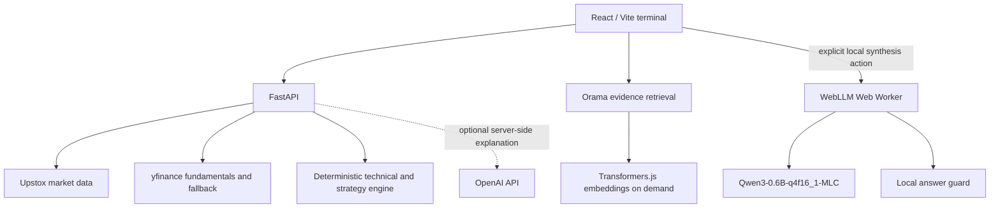

# WOWMAZING Market Agent

WOWMAZING is a market research terminal with a deterministic FastAPI backend, a React/Vite frontend, browser-side evidence retrieval, and optional local narrative synthesis.

## Architecture



- **FastAPI is authoritative** for market snapshots, technical indicators, fundamentals, strategy evidence, risk, and invalidation values. Upstox supplies primary Indian market data; yfinance supplies fundamentals, global data, and the configured fallback. The deterministic strategy engine analyzes historical candles and does not forecast future prices.
- **Browser retrieval** indexes evidence provided by the application with Orama. Transformers.js generates embeddings only when retrieval is requested, trying WebGPU and falling back to WASM where available. Retrieval ranks supplied evidence; it is not a general web search service.
- **Local AI is optional and explicit.** Ask WOWMAZING loads the WebLLM runtime only after the user selects local synthesis. Inference runs in a dedicated Web Worker; the worker loads one Qwen3 model instance and keeps model computation off React's main thread. The local answer guard strips hidden reasoning and rejects uncited, numeric, or unsupported claims. The deterministic backend and risk panel remain authoritative.
- **No per-query cloud LLM is required for local inference.** The first local run downloads model assets and browser storage caches them for later use. Independently, the backend can call OpenAI for its optional server-side explanation when configured; this is not used by the local worker.

## Environment variables

`.env.example` documents all application settings. It contains placeholders only. Backend secrets must stay server-side and must never use a `VITE_` prefix.

| Variable | Read by | Purpose |
| --- | --- | --- |
| `VITE_API_BASE_URL` | Vite build | Public FastAPI base URL embedded in the frontend. Defaults locally to `http://127.0.0.1:8000`; set it to the deployed API URL in Vercel. It must not contain credentials. |
| `MARKET_DATA_PROVIDER` | FastAPI | `upstox` (default) or `yfinance`. |
| `ALLOW_YFINANCE_FALLBACK` | FastAPI | Whether yfinance may provide market data when Upstox fails; defaults to `true`. |
| `UPSTOX_ANALYTICS_TOKEN` | FastAPI | Server-side Upstox access token. Required for Upstox market data. |
| `OPENAI_API_KEY` | FastAPI | Optional server-side key for the backend explanation. Not used by local WebLLM. |
| `OPENAI_MODEL` | FastAPI | Model for the optional backend explanation; defaults to `gpt-5.6-luna`. |
| `CORS_ORIGINS` | FastAPI | Comma-separated allowed browser origins. If unset, the API allows only local Vite/Tauri origins. Configure the deployed frontend origin in production. Empty entries are ignored; wildcard origins and URL paths are rejected. |

Render supplies `PORT` to the backend process. Do not put API keys or provider tokens in Vercel's `VITE_*` variables or browser code.

## Local development

From the repository root in PowerShell:

```powershell
npm ci
py -3.11 -m venv backend\.venv
.\backend\.venv\Scripts\Activate.ps1
python -m pip install -r backend\requirements.txt
Copy-Item .env.example backend\.env
```

Edit `backend/.env` and replace the credential placeholders locally. The file is ignored by Git. `VITE_API_BASE_URL` is not needed for the local default. If you need to override it, set it in a root `.env.local` file; Vite only exposes that URL to the client.

Start FastAPI from the repository root:

```powershell
python -m uvicorn backend.server:app --reload --host 127.0.0.1 --port 8000
```

In a second terminal, start the frontend:

```powershell
npm run dev
```

Vite serves the app at `http://localhost:1420`; the backend health endpoint is `http://127.0.0.1:8000/health`. Local development CORS defaults also allow `127.0.0.1:1420` and the local Tauri origins.

## Production deployment

- **Frontend — Vercel:** deploy the Vite project as a static site using `npm run build` and the `dist/` output. `vercel.json` rewrites client-side routes to `index.html`. Set `VITE_API_BASE_URL` to the public FastAPI URL in the Vercel build environment; Vite embeds it at build time. Do not set provider credentials there.
- **Backend — Render:** `render.yaml` defines the Python web service, installs `backend/requirements.txt`, starts `backend.server:app`, and checks `/health`. Add `UPSTOX_ANALYTICS_TOKEN` and `CORS_ORIGINS` in Render's environment settings; add `OPENAI_API_KEY` only if the optional backend explanation is wanted. Set `CORS_ORIGINS` to the exact frontend origin, for example `https://market.example.com` (scheme and host, no path). Comma-separated additional origins are supported.
- The backend must be reachable from the browser over HTTPS in production. The frontend API URL and backend CORS allowlist must point to the corresponding deployments.
- The Tauri desktop wrapper uses the same frontend configuration and still requires a reachable FastAPI service.

## Limitations and resource use

- WebGPU and Web Workers are required for local WebLLM synthesis. The model is large and can use substantial GPU and system memory. Worker isolation keeps inference off the UI thread but cannot isolate device memory or prevent browser/driver instability on constrained hardware. If local synthesis is unavailable or fails, use the deterministic response.
- A previous QA run on an 8 GB Intel integrated-graphics laptop crashed the browser tab during model initialization. Resource limits were subsequently reduced, but that device has not been re-tested with WebLLM after those mitigations. Do not treat local inference as available until it has been validated on target devices.
- Model assets require an initial download and browser storage for caching. Browser storage can be cleared or evicted by the browser.
- Browser retrieval only ranks evidence already supplied to it and cannot independently verify provider data. Upstox access, market hours, provider limits, yfinance delays, and missing or stale fundamentals affect data availability.
- If `OPENAI_API_KEY` is configured, the backend sends its analysis request and evidence to OpenAI for the optional explanation. Local inference itself has no per-query cloud LLM dependency.
- Vite may report large-chunk advisories for ML-related assets. Transformers.js retrieval and WebLLM are dynamically loaded; the WebLLM worker is emitted separately, and neither model initializes when the terminal first opens.
