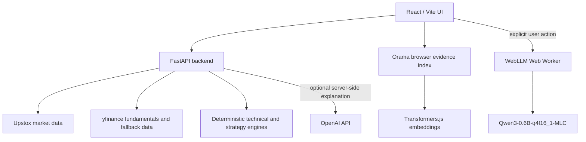

# WOWMAZING Market Agent

WOWMAZING is a market research terminal with a deterministic FastAPI backend, a React/Vite interface, browser-side evidence retrieval, and optional on-device narrative synthesis.

## Architecture



- **Deterministic backend:** FastAPI serves market data, fundamentals, technical calculations, strategy evidence, and the structured `/agent` response. Numeric market and risk values come from backend calculations and remain authoritative. Without an OpenAI key, or if its explanation call fails, `/agent` returns the deterministic response.
- **Market and company data:** Upstox is the primary provider for Indian equities and indices. yfinance supplies fundamentals and is also used for global data and the configured market-data fallback.
- **Technical and strategy analysis:** Indicators and strategy evidence are calculated by the backend. Strategy history is descriptive evidence, not a forecast.
- **Browser retrieval:** Orama ranks the market, fundamental, technical, strategy, and other evidence supplied to the UI. Transformers.js creates embeddings on demand; it tries WebGPU and falls back to WASM if that path fails. This retrieval layer searches supplied evidence; it is not a general web search service.
- **Optional local synthesis:** Ask WOWMAZING can explicitly send its compact, source-tagged evidence packet to Qwen3 through `src/ai/local/webllm.worker.ts`. WebLLM is dynamically imported inside that worker, only after the user starts synthesis. Output is sanitized and checked; the local model narrates evidence and does not own numeric facts or risk decisions.
- **Cloud use:** Local WebLLM inference does not require a per-query cloud LLM API call. The first local run does require downloading model assets; successful downloads are cached in browser storage. Separately, the backend can use OpenAI for its optional server-side explanation when `OPENAI_API_KEY` is configured.

## Local development

Use Node.js/npm and Python 3.11. From the repository root in PowerShell:

```powershell
npm ci
py -3.11 -m venv backend\.venv
.\backend\.venv\Scripts\Activate.ps1
python -m pip install -r backend\requirements.txt
```

Create `backend/.env` for backend settings. Set `UPSTOX_ANALYTICS_TOKEN` for Upstox data; keep this file local and never commit it. The repository-root `.env.example` documents the frontend API URL. To override the default local API address, create `.env.local` in the repository root with:

```text
VITE_API_BASE_URL=http://127.0.0.1:8000
```

Start the backend from the repository root:

```powershell
python -m uvicorn backend.server:app --reload --host 127.0.0.1 --port 8000
```

In a second terminal, start the frontend:

```powershell
npm run dev
```

Vite serves the UI at `http://localhost:1420`; the backend health endpoint is `http://127.0.0.1:8000/health`. The frontend defaults to that local API address when `VITE_API_BASE_URL` is unset.

## Environment variables

| Variable | Used by | Purpose |
| --- | --- | --- |
| `UPSTOX_ANALYTICS_TOKEN` | FastAPI | Upstox access token for Indian market data. Keep it server-side. |
| `MARKET_DATA_PROVIDER` | FastAPI | Selects `upstox` (default) or `yfinance` as the market-data provider. |
| `ALLOW_YFINANCE_FALLBACK` | FastAPI | Allows yfinance market data when Upstox is unavailable; defaults to `true`. |
| `OPENAI_API_KEY` | FastAPI | Optional key for the backend’s server-side explanation. Not needed for local WebLLM inference. |
| `OPENAI_MODEL` | FastAPI | Optional model selection for that explanation; defaults to `gpt-5.6-luna`. |
| `VITE_API_BASE_URL` | Vite build | FastAPI base URL compiled into the frontend; defaults to `http://127.0.0.1:8000`. |
| `PORT` | Hosting platform | Render supplies the API listening port in deployment. |

For local backend settings, place these names in `backend/.env`; omit optional variables when not needed. For deployment, configure secrets in the hosting provider’s environment settings rather than in source control or frontend variables.

## Production deployment

- **Frontend:** `npm run build` creates the static site in `dist/`. Deploy it to Vercel or another static host. `vercel.json` rewrites routes to `index.html` for the single-page app. Set `VITE_API_BASE_URL` to the deployed FastAPI URL before building.
- **Backend:** `render.yaml` describes a separate Render Python web service running `uvicorn backend.server:app`. Configure the Upstox token and any optional server-side OpenAI settings in Render. The API health check is `/health`.
- **Browser model assets:** The built Web Worker is served with the frontend assets. On explicit local synthesis, the browser fetches the WebLLM model/runtime assets and caches model data locally; later runs can reuse that cache.
- **Desktop:** The same frontend can also be run in the Tauri wrapper. The API still needs to be reachable at the configured `VITE_API_BASE_URL`.

## Privacy, resources, and limitations

- The evidence packet is assembled in the browser and passed to a Web Worker; WebLLM model loading, tokenization, and generation run there. The worker keeps inference off React’s main JavaScript thread, but it does **not** isolate GPU or system-memory use; WebGPU allocation can still make a constrained browser unstable.
- Local synthesis requires browser support for WebGPU and Web Workers. The model is large, needs an initial download, and relies on browser storage for caching. A previous QA run on an 8 GB Intel integrated-graphics laptop crashed the browser tab during model initialization. Resource handoff and lower context/output limits have since been added, but that device has not yet been re-tested with the model. Use the deterministic backend response if local synthesis is unavailable or fails.
- The UI sends analysis requests to the configured FastAPI service. If the optional server-side OpenAI explanation is enabled, that service also sends the supplied request/evidence to OpenAI. Local synthesis itself does not require that service.
- Upstox access, market hours, provider limits, and supported instruments affect data availability. yfinance may be delayed, incomplete, or unavailable; fundamentals can be missing or stale.
- Browser retrieval ranks only evidence already supplied to it and cannot independently verify provider data. Historical strategy results do not predict future performance.
- The current FastAPI CORS middleware allows all origins. Although `render.yaml` declares `CORS_ORIGINS`, the server does not currently read it; restrict CORS origins before exposing the API publicly.
- The production build still emits a Transformers.js chunk above Vite’s 500 kB warning threshold. Heavy model runtimes remain code-split and lazy-loaded, but the warning is unresolved.
